# Rohy

Rohy is a virtual-patient clinical simulation platform. A learner interviews an AI patient whose vital signs advance on a physiology engine, moves between rooms that stay live across one session, calls a multi-agent care team, and closes the case in a debrief with a separate AI discussant. Every action is written to a learning-event log that feeds a transition-network analytics dashboard.

The public website is `website/index.html`. The documentation site sources live in [`docs/`](docs/) and build with `npm run docs:build`.

## Status

| Item | Value |
|---|---|
| Package version | `3.0.0-beta.9` (`package.json`) |
| Latest git tag | `v3.0.0-beta.9` |
| Latest release | [`v3.0.0-beta.9`](https://github.com/mohsaqr/rohySimulator/releases/tag/v3.0.0-beta.9), published 2026-09-03 |
| Release assets | air-gap source tarball and air-gap Docker tarball, each with a `.sha256` |
| Container image | `ghcr.io/mohsaqr/rohy:v3.0.0-beta.9` and `ghcr.io/mohsaqr/rohy:latest`, an OCI index covering `linux/amd64` and `linux/arm64` |
| Licence | Carm Research License v1.4 ([`LICENSE`](LICENSE)) |

Releases carry a channel in their title: `v2.9.119` is titled "Stable fixes (pre-plugin channel)" and `v2.9.132` is titled "Advanced: PACS, Pathology & ECG workstations". [`docs/INSTALL.md`](docs/INSTALL.md) names the two channels `current` (without the PACS, Pathology and ECG rooms) and `advanced` (with those rooms, imaging content required).

## Requirements

| Requirement | Value | Where it is pinned |
|---|---|---|
| Node | 22.x | `.github/workflows/ci.yml`; `deploy/docker/Dockerfile` (`ARG NODE_VERSION=22-bookworm-slim`) |
| Sibling clone | `dynajs` at `../dynajs` | `package.json` (`"dynajs": "file:../dynajs"`) |
| Sibling clone | `rohy-3d-patient-room` at `../3D` | `package.json` (`"rohy-3d-patient-room": "file:../3D"`) |
| `curl` on PATH | fetches the Oyon model files during `postinstall` | `OyonR/scripts/download-models.sh` |
| Docker | optional, for the published image and the compose stack | `deploy/docker/compose.yml` |
| Disk, Oyon models | 66.6 MiB across 5 files (69,811,801 bytes) | measured under `OyonR/standalone/models/` |
| Disk, PACS archive | 777,460,547 bytes (741.4 MiB), 4,267 files | `scripts/content-sources.json` |
| Disk, Pathology archive | 36,818,816 bytes (35.1 MiB), 1,257 files | `scripts/content-sources.json` |

## Install

### Quick start

Clone both siblings first, because `package.json` declares them as `file:` dependencies. `npm install` then runs `postinstall`, which calls `npm run setup:oyon` and downloads the model files.

```bash
git clone https://github.com/mohsaqr/dynajs.git ../dynajs
(cd ../dynajs && npm install)
bash scripts/clone-room3d.sh ../3D
npm install
cp server/.env.example server/.env
npm run dev
```

Set `JWT_SECRET` in `server/.env` before starting. The Vite dev server listens on port 5173 and proxies `/api` to `http://localhost:3000`; the Express server reads `PORT` and falls back to 3000. The development seeder creates `admin` / `admin123` and `student` / `student123`; in production that seeder requires `ALLOW_DEFAULT_USERS=1`.

Optional add-ons: `npm run setup:oyon` re-runs the model download on its own, `npm run setup:content` installs the PACS and Pathology archives, and `npm run install:piper` installs local Piper voices.

### Production, update and air-gap

The published image runs under the compose stack. `deploy/bootstrap.sh` installs from source onto a Linux host with systemd and nginx, and also accepts `--dry-run`, `--no-nginx`, `--no-piper`, `--no-audit`, `--skip-build`, `--prewarm-kokoro` and `--reverse-proxy`. `bin/rohy-update` drives upgrades of source and systemd installs, with subcommands `check`, `apply`, `rollback`, `list-backups` and `restore-backup`. `deploy/bundle-airgap.sh` writes a self-contained tarball in `source`, `docker` or `both` mode.

```bash
docker pull ghcr.io/mohsaqr/rohy:v3.0.0-beta.9
docker compose -f deploy/docker/compose.yml up -d
sudo deploy/bootstrap.sh --frontend-url=https://your-host/rohy --admin-bootstrap
sudo rohy-update check
sudo rohy-update apply
deploy/bundle-airgap.sh --mode=source --with-hf-cache --with-dynajs --with-3d
```

Operator guides: [`docs/INSTALL.md`](docs/INSTALL.md), [`docs/DEPLOY.md`](docs/DEPLOY.md), [`docs/UPDATING.md`](docs/UPDATING.md), [`docs/UPDATE-STRATEGY.md`](docs/UPDATE-STRATEGY.md).

## The rooms

The bottom navigator holds core rooms and plugin rooms, sorted by the `order` field on each room definition. The core rooms are always present; plugin rooms render when the case enables them. Labels are the on-screen strings from `src/locales/en/common.json`.

| Room | Navigator label | What happens there | Source location |
|---|---|---|---|
| Patient | `Patient` · `chat` | The patient interview, the live monitor, the treatment controls, the End & Debrief action | `src/components/chat/`, `src/components/monitor/` |
| Bedside | `Bedside` · `immersive patient view` | The same patient at the bedside, sharing the session physiology and the one patient conversation; the body opens the examination wheel, the chart and the IV pole open the Records and Treatments drawers | `src/plugins/room3d/` |
| Examination | `Examination` · `physical exam` | Region and technique selection on a body map, auscultation point picker, examination log | `src/components/examination/` |
| Laboratory | `Laboratory` · `investigations` | Test catalogue, ordering, worklist with a turnaround, rendered report | `src/components/investigations/` |
| Radiology | `Radiology` · `imaging & tests` | Imaging catalogue, ordering, worklist, report | `src/components/investigations/` |
| 12-lead ECG | `12-lead ECG` · `interpretation` | Twelve-lead reading workstation with calipers and a lead map | `src/plugins/ecg/`, `src/components/ecg/` |
| Pathology | `Pathology` · `slides` | Whole-slide viewer with a magnification ladder, scale bar and annotation measurement | `src/plugins/pathology/`, `src/components/pathology/` |
| PACS | `PACS` · `workstation` | DICOM reading room: multi-series studies, thumbnail rail, side-by-side viewports, window width and level | `src/plugins/pacs/`, `src/components/pacs/` |
| Consultant | `Consultant` · `debrief` | The debrief room with its own persona, voice, avatar and model | `src/components/discussion/` |

[`docs/trainee/rooms.md`](docs/trainee/rooms.md) documents every room, and which of them a given case shows.

## Features

### Conversation and agents

| Fact | Value |
|---|---|
| LLM platforms through `/api/proxy/llm` | `anthropic`, `openai`, `google`, `lmstudio`, `custom` (`server/routes/proxy-routes.js`) |
| Shipped agent templates | 6, in `DEFAULT_AGENTS` (`server/db.js`) |
| Agent types | `patient` (two templates), `nurse`, `consultant`, `relative`, `discussant` |
| Named personas | Default Patient, Default Female Patient, Sarah Mitchell (Bedside Nurse), Dr. James Chen (Senior Consultant), Family Member, Default Discussant |
| Paging | `agent_session_state.arrives_at` is stamped server-side (`migrations/0024_agent_arrives_at.sql`) |
| Turn provenance | `interactions.source` records `typed`, `voice` or a plugin room id (`migrations/0053_interactions_source.sql`) |

### Voice and avatars

`TTS_PROVIDERS` in `server/shared/voiceIdentity.js` lists four engines: `kokoro` (local, in-process through `kokoro-js`), `piper` (local subprocess, voices under `server/data/piper/`), `google` (cloud) and `openai` (cloud). The voice id determines the engine by exact catalogue membership. `public/avatars/heads/` holds 28 GLB heads and a `manifest.json`. Lipsync runs through `wawa-lipsync` over Three.js and `@react-three/fiber`.

### Patient monitor and physiology

- Seven channels: HR, SpO₂, systolic and diastolic NIBP, RR, temperature, EtCO₂.
- `src/services/ecgWaveform.js` builds the trace from a sum of Gaussians, with the PR interval from an Atterhög 1977 regression and QT by Fridericia.
- The monitor vocabulary names 10 rhythms: Normal Sinus Rhythm, Sinus Bradycardia, Sinus Tachycardia, Atrial Fibrillation, Atrial Flutter, Supraventricular Tachycardia, Ventricular Tachycardia, Ventricular Fibrillation, Asystole, Pulseless Electrical Activity.
- Vitals persist through a deadband of `{ hr: 10, spo2: 5, bpSys: 10, bpDia: 10, rr: 3, temp: 0.5 }`.
- Bedside samples the same generator, so both views show one physiology.

### Treatments

`server/data/treatment_effects.json` carries 264 rows over 245 distinct treatment names, each with onset, peak and duration in minutes, per-channel effects, and `rxcui`, `pk_source` and `pk_evidence_url` provenance fields. By type: `medication` 204 rows over 185 names, `nursing` 31, `iv_fluid` 16, `oxygen` 13.

### Investigations

| Catalogue | Count | Source |
|---|---|---|
| Laboratory tests | 222 (215 base plus 7 merged cardiac) | `server/data/lab_database.json` and `server/data/lab_cardiac_tests.txt`, merged by `server/services/labDatabase.js` |
| Laboratory groups | 33 | derived from the merged catalogue |
| Lab panel templates, search aliases | 32, 62 | `src/data/labPanelTemplates.js` |
| Radiology studies | 74 | `server/data/radiology_database.json` |
| Radiology modalities | 9: Cardiac 16, X-Ray 13, Ultrasound 12, CT 11, MRI 11, Nuclear Medicine 6, Fluoroscopy 3, Mammography 1, DEXA 1 | same file |
| Lab and radiology result templates | 8 and 6 | `src/data/investigationTemplates.js` |

Reference ranges split by `category` where clinically relevant: Hemoglobin is 12-16 g/dL for Female and 14-18 g/dL for Male. Turnaround is clamped to a 1 to 5 minute band by `migrations/0023_clamp_turnaround_to_5min.sql`. The DICOM reading room, the whole-slide viewer and the twelve-lead workstation are RPS-1 plugins with their own manifests, capabilities and authoring surfaces.

### Examination

`src/data/examRegions.js` defines 57 body regions (37 anterior, 18 posterior, 2 special) and 12 techniques: inspection, palpation, percussion, auscultation, special tests, mental status, cranial nerves, motor, sensory, reflexes, coordination, gait. Each region carries default findings per technique and a `specialTests` list.

### Alarms and notifications

One `NotificationCenter` (`src/notifications/`) with six surfaces: `AudioSurface`, `BackendSurface`, `BannerSurface`, `ConsoleSurface`, `HistorySurface`, `ToastSurface`. Routing, persistence and defaults are separate modules with their own tests.

### Debrief

Ending a case opens `src/components/discussion/`, which resolves its own persona, voice, avatar and model from the `discussant` agent type. `server/services/encounterRecord.js` assembles the learner's encounter record for that conversation.

### Analytics and learning events

`server/shared/learningVerbs.js` holds 90 base verbs; with the registered plugin vocabularies the whitelist reaches 136. Events carry one of eight categories (SESSION, NAVIGATION, CLINICAL, COMMUNICATION, MONITORING, CONFIGURATION, ASSESSMENT, ERROR) and one of five severities (DEBUG, INFO, ACTION, IMPORTANT, CRITICAL), both derived server-side from the verb. `learning_events.room` stamps the active room (`migrations/0021_learning_events_room.sql`). The dashboard is `src/components/analytics/tna/TnaDashboardV2.jsx`, with sequence, clinical-state and window modules beside it.

### Oyon capture

Face landmarking and emotion classification run in the browser. `OyonR/scripts/download-models.sh` fetches five files, each checked against a SHA-256 recorded in the script.

| File | Size | Upstream |
|---|---|---|
| `face_landmarker.task` | 3.6 MiB | MediaPipe |
| `mobilevit_va_mtl.onnx` | 37.6 MiB | EmotiEffLib |
| `enet_b0_8_va_mtl.onnx` | 15.3 MiB | EmotiEffLib |
| `mbf_va_mtl.onnx` | 7.9 MiB | EmotiEffLib |
| `silero_vad.onnx` | 2.2 MiB | Silero VAD v5.1.2 |

The server mounts the Oyon routes when `OYON_ENABLED=1`, and `deploy/env.example` ships that value. With the variable unset, the routes answer a structured 503 and the settings tab renders a disabled panel. Oyon tables and settings arrive through `migrations/0011_oyon_addon.sql` and eleven later Oyon migrations.

### Courses, lessons and users

Cohorts, courses and lessons have their own tables and routers: `migrations/0025_cohorts.sql`, `0027_cohort_entity.sql`, `0032_lessons.sql`, `server/routes/cohorts-routes.js`, `server/routes/lessons-routes.js`, `server/routes/surveys-routes.js`. Registration invites and requests arrive in `migrations/0037_registration_invites.sql` and `0038_registration_requests.sql`.

### Help and support

`src/help/` mounts a Help & Support drawer from `App.jsx` with three tabs. The Help tab lists 23 articles from `HELP_ARTICLES`, filtered by role rank: 15 reach `student`, 20 reach `educator`, 23 reach `admin`, grouped as Using the simulator, Teaching and Administration. Each article links to a page on the VitePress docs site under `DOCS_BASE` (`/rohy/docs/`, overridable with `VITE_DOCS_BASE`), and all 23 target files exist under `docs/`. The What's new tab reads `GET /api/help/release-notes`, which parses `CHANGELOG.md` in Keep a Changelog format. The Support tab reads `GET /api/help/diagnostics`, a bundle of version, runtime and boolean health flags passed through `server/redaction.js`. `OnboardingTour` plays a per-role first-run tour at `TOUR_VERSION` 1, four steps for `student` and four for `educator`, recorded in `localStorage` under `rohy.onboarding.<role>.v<version>`. The drawer chrome is translated: 62 keys per locale in `src/locales/<lang>/help.json` across all seven locale directories.

### Administration and authoring

`src/components/settings/` holds 32 non-test `.jsx` components, including the agent persona editor and the per-tab settings editors. `src/data/scenarioTemplates.js` carries 16 scenario templates. `server/seeders/cases.js` seeds 6 cases on first boot: Acute Chest Pain - STEMI, Septic Shock - Pneumonia, Diabetic Ketoacidosis, Acute Asthma Exacerbation, Acute Stroke - Left MCA, Maria Mercedes - Acute STEMI. `server/scripts/seed-acute-cases.cjs` seeds a further set on demand. Case codes come from `migrations/0035_case_code.sql`.

### Internationalisation

Six languages in `server/shared/languages.js`: English, Italian, Finnish, Swedish, German, Spanish, with `en` as the default. Each entry carries a display name, a native name, a flag, a Web Speech STT locale and an LLM output directive. `src/locales/` also holds the `en-XA` pseudo-locale produced by `npm run i18n:pseudo`. Extraction, status, XLIFF export and XLIFF import each have an npm script.

### Security and governance

| Area | Value |
|---|---|
| Role ranks | `guest` 0, `student` 1, `reviewer` 2, `educator` 3, `admin` 4 (`server/middleware/auth.js`) |
| Password hashing | `bcrypt` |
| Session TTL | `DEFAULT_TTL_SECONDS = 7 * 86400`; `server/.env.example` sets `JWT_EXPIRY=24h` |
| Rate limits | 600 requests per minute overall, 10 login attempts per 15 minutes, 5 registrations per hour |
| Audit hash chain | `migrations/0008_audit_hash_chain.sql`, `server/audit-chain.js`, `scripts/verify-audit-chain.js` |
| Response redaction | `server/redaction.js` |
| Tenancy | `migrations/0004_tenants.sql` |
| Retention | `migrations/0005_retention.sql`, `scripts/retention-sweep.js` |
| Audit shell scripts | 18 at `scripts/audit-*.sh` |

## Screenshots

The 13 images below live in [`docs/images/screens/`](docs/images/screens/).

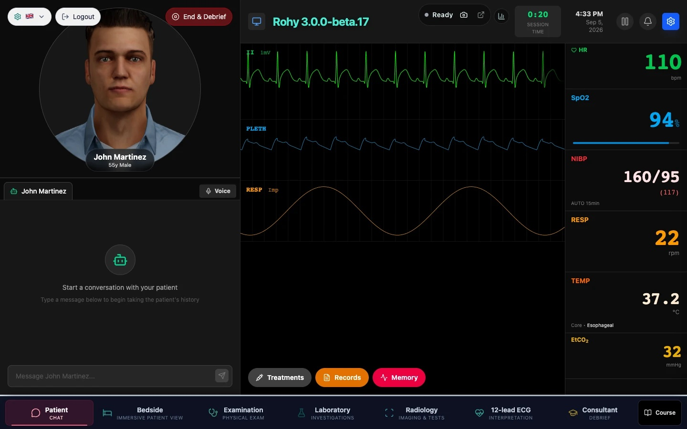
The patient room: avatar and chat on the left, the live monitor on the right, a red clinical alarm banner with Snooze and Acknowledge, the session clock at top right, and the room navigator along the bottom.

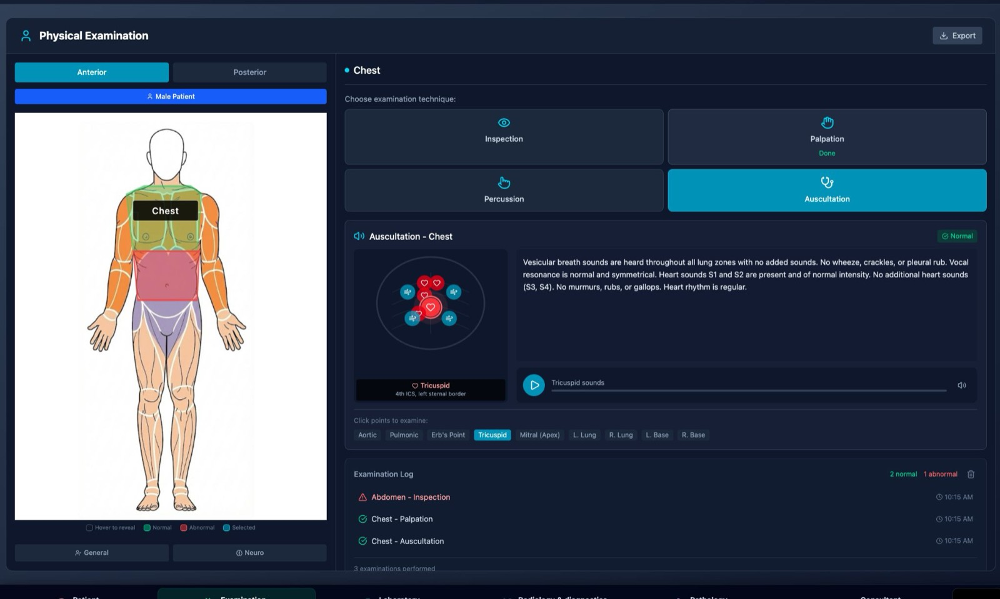
The examination room: an anatomical body map with region hit areas, a technique chooser, the auscultation point picker, and the Examination Log.

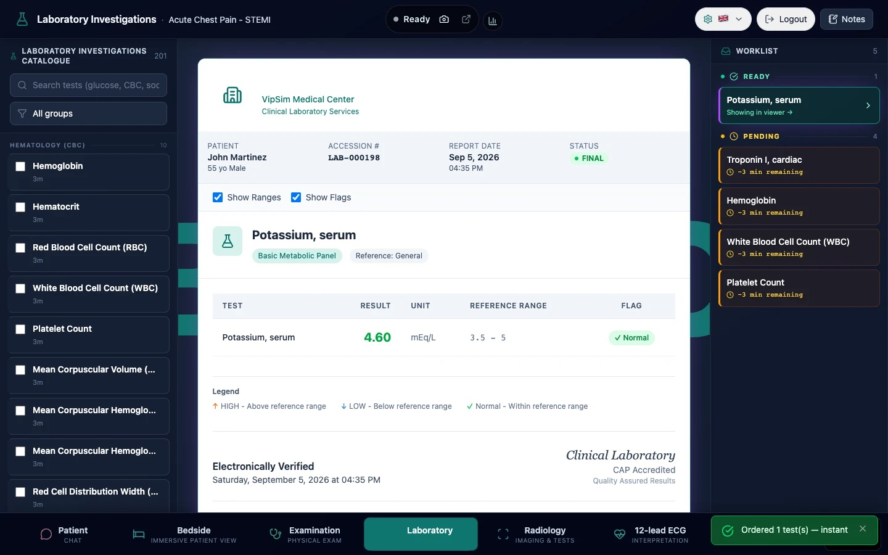
The laboratory: the searchable test catalogue on the left, a rendered lab report with reference ranges in the middle, and the worklist with pending, ready and viewed states on the right.

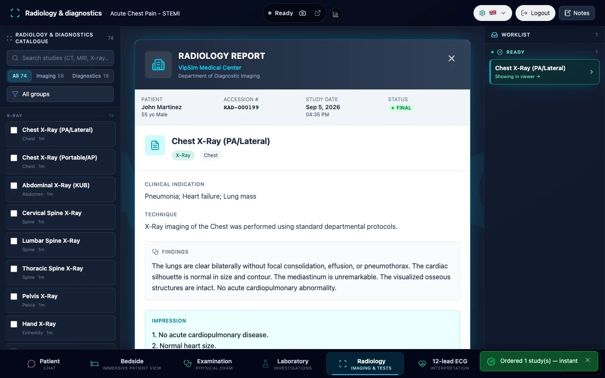
The radiology room: the imaging catalogue, counters for pending, ready and viewed studies, and the worklist of ordered studies.

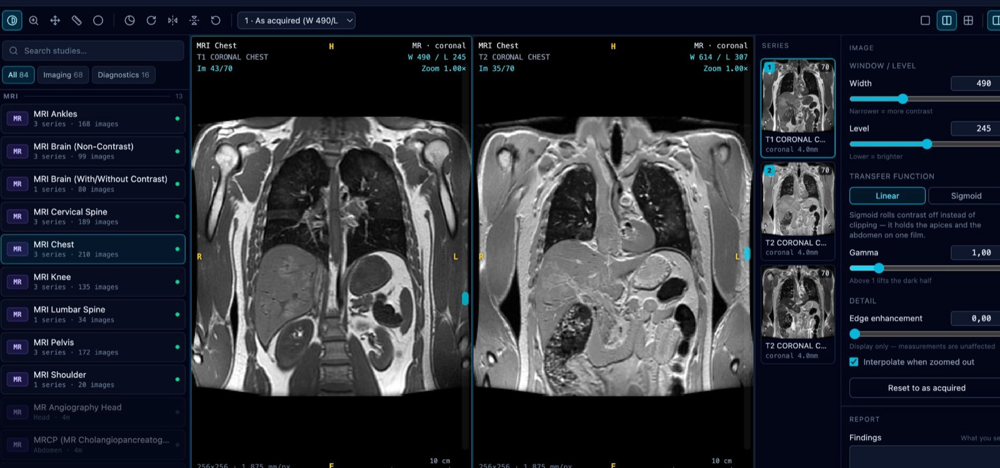
The PACS room: a multi-series MRI study with a thumbnail rail, two viewports side by side, and window width and level controls.

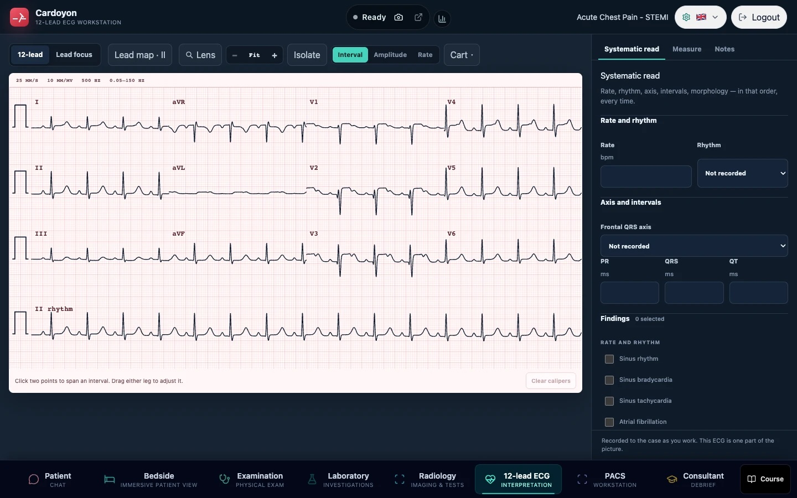
The twelve-lead ECG room: calibrated paper, gain and sweep-speed selectors, filter selectors, calipers with retained measurements, and a lead map.

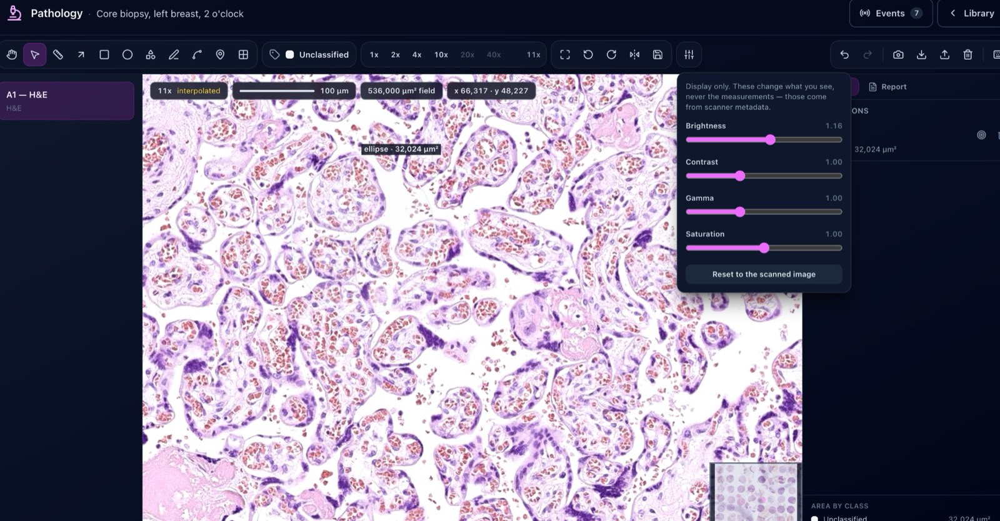
The pathology room: a whole-slide H&E image with a magnification ladder, a scale bar in microns, an ellipse annotation reporting an area, and the display-only adjustment panel.

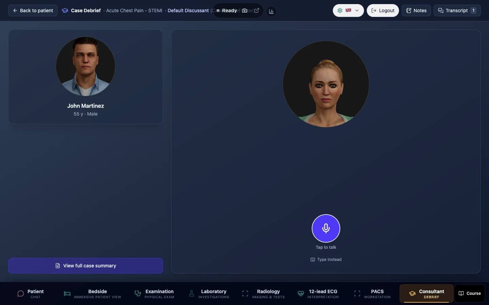
The debrief room: the discussant with its own avatar and voice, in voice mode, after the case has ended.

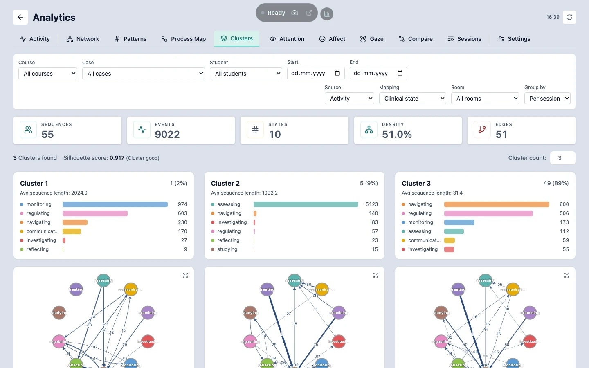
The analytics dashboard: learner clusters, one transition network per cluster, and state distributions over time with a silhouette score.

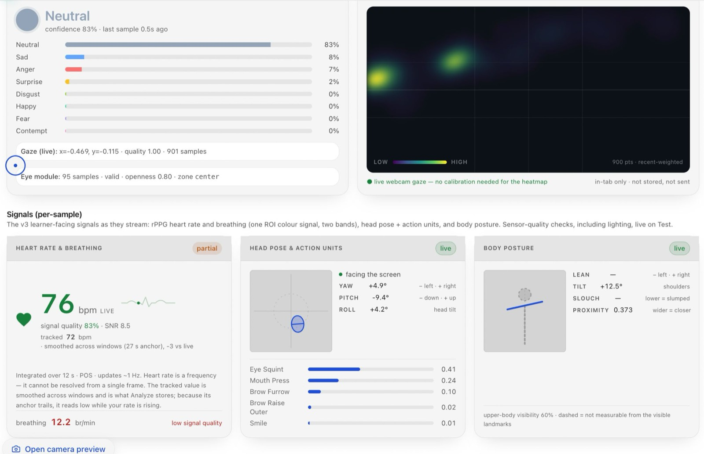
The Oyon panel: emotion probabilities, gaze, head pose, body posture, and an rPPG heart-rate estimate with its integration window and signal-quality flags.

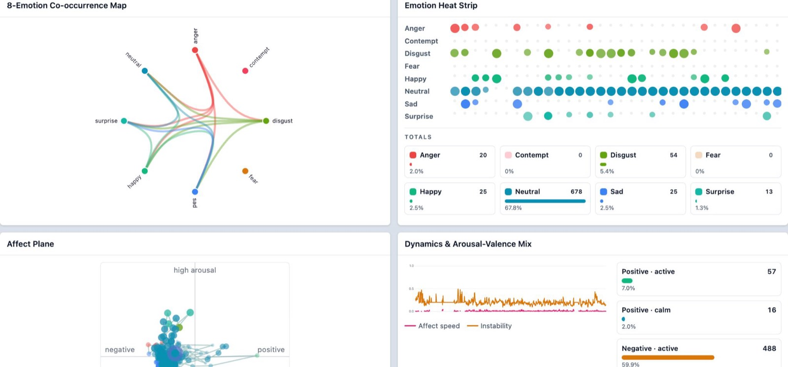
Post-session affect: an emotion co-occurrence map, a heat strip across the session, and the arousal-valence plane, with counts beside percentages.

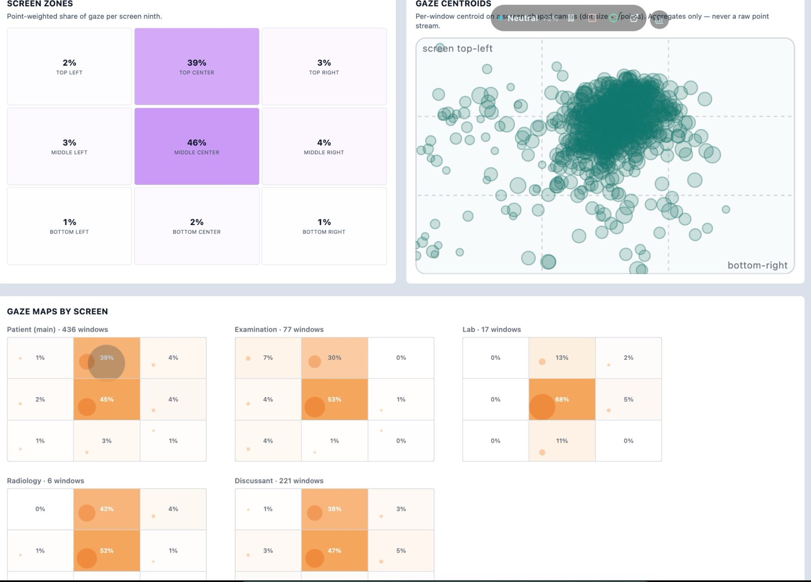
Gaze aggregates: per-screen-ninth shares, gaze centroids, and the same shares broken down by room.

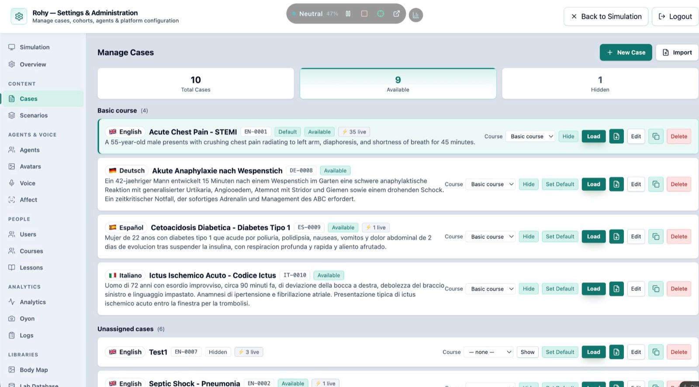
The admin case list: English, German, Spanish and Italian cases in one course, each with a language flag, a case code, and a live-session count.

## Architecture

```
rohySimulator/
├── bench/        vitest benchmarks (3 files)
├── bin/          rohy-update, the operator CLI
├── deploy/       bootstrap.sh, local-install.sh, bundle-airgap.sh, preflight.sh,
│                 rollback.sh, env.example, docker/, nginx/, systemd/
├── docs/         VitePress site: trainee, educator, admin, operator, integrator,
│                 security, product, design, tutorials, reference, audits
├── licenses/     embedded third-party licence texts
├── migrations/   53 versioned SQL migrations plus MANIFEST.md
├── OyonR/        in-browser emotion capture package (src, tests, standalone, scripts)
├── public/       static assets, including avatars/heads/ (28 GLB + manifest.json)
├── scripts/      18 audit-*.sh, docs-gen/, i18n/, knowledge/, rocketbox-convert/,
│                 migrate.js, retention-sweep.js, tech-test.sh, smoke.sh, and the
│                 setup-content / plugin-manifest / vendor generators
├── server/       Express 5 application: routes/ (24 router modules composed by
│                 server/routes.js), middleware/ (auth, request id, logger, error
│                 handler, route timeout), config/, data/, lib/, seeders/,
│                 services/, shared/, and db.js, dbAdapter.js, migrationRunner.js,
│                 observability.js, redaction.js, server.js
├── src/          React 19 client: components/ (22 areas including chat, monitor,
│                 examination, investigations, orders, treatments, analytics,
│                 discussion, settings, voice, ecg, pacs, pathology, oyon, lessons),
│                 help/ (the Help & Support drawer and onboarding tour), plugins/
│                 (RPS-1 registry plus ecg, pacs, pathology, room3d), notifications/
│                 (center, routing, 6 surfaces), contexts/, data/, hooks/, i18n/,
│                 locales/ (7 dirs), services/, storage/, utils/, config/, constants/
├── tests/        145 server tests, 14 Playwright specs, shared utils
└── website/      the static public site
```

### Request flow

`server/server.js` boots Express, mounts `server/routes.js` under `/api`, and composes 24 router modules from `server/routes/`. `server/middleware/auth.js` extracts the JWT, resolves the role rank and the tenant, and refreshes role, status and tenant from the `users` table on every request. `server/middleware/routeTimeout.js` bounds each request, with the TTS and LLM proxy routes exempt because they stream. `server/redaction.js` filters the response before it leaves the process, and `server/observability.js` writes NDJSON access records carrying the request id.

### Database and migrations

SQLite through the `sqlite3` async API, wrapped by `server/dbAdapter.js`. `server/migrationRunner.js` applies the 53 files in `migrations/` in order and records them in `schema_migrations`. `migrations/MANIFEST.md` states the policy: additive by default, with destructive changes gated behind `--allow-destructive`.

### Plugins

`src/plugins/index.js` discovers plugins with `import.meta.glob('./*/index.jsx')`, so deleting a plugin directory removes its room and leaves the build working. `npm run plugins:gen` freezes each `manifest.js` into `server/shared/plugins/manifests.generated.js`, which allows the server to read plugin vocabulary without importing from `src/`. `npm run plugins:check` runs in `prebuild`.

| Plugin | Room order | Declared capabilities |
|---|---|---|
| `room3d` | 15 | `case`, `conversation`, `drawer` |
| `ecg` | 45 | `persist` |
| `pathology` | 50 | `persist`, `remote` |
| `pacs` | 55 | `persist`, `remote`, `orders` |

A manifest may also declare `authoring` (a case-editor slot with its own minimum role), `settings` (operator fields), `remote` (allowed content path prefixes and content types), `catalog` (an archive shape plus learner-visible keys), and `document.learnerOmit` (paths the server strips for roles below reviewer).

## Configuration

From `deploy/env.example`. The values shown are the ones the template writes.

| Variable | Template value | Purpose |
|---|---|---|
| `JWT_SECRET` | `REPLACE_ME_WITH_A_LONG_RANDOM_STRING` | Signs every auth token. The server refuses to start without it. |
| `NODE_ENV` | `production` | Disables seeders, dev helpers and request-body verbosity. |
| `FRONTEND_URL` | `https://your-deploy-host/rohy` | The public URL, added to the CORS allowlist. |
| `ROHY_DB` | `/opt/data/rohy/database.sqlite` | Absolute path to the SQLite database. |
| `TRANSFORMERS_CACHE` | `/var/cache/rohy-hf` | Where the Kokoro model cache lives. |
| `PORT` | `4000` | HTTP listener. The server default is 3000. |
| `OYON_ENABLED` | `1` | Mounts the Oyon add-on routes. |
| `HTTPS_PORT` | commented | Direct HTTPS listener. Defaults to `PORT` plus 1000. |
| `TLS_CERT_PATH` | commented | PEM certificate for the optional HTTPS listener. |
| `TLS_KEY_PATH` | commented | PEM key for the optional HTTPS listener. |
| `ROHY_TRUST_PROXY` | commented | Express trust-proxy setting. Default `loopback`. |
| `ROHY_SHUTDOWN_GRACE_MS` | commented | Graceful-shutdown wait after SIGTERM. Default 15000. |
| `ROHY_ROUTE_TIMEOUT_MS` | commented | Per-request timeout. Default 30000. |
| `ROHY_BACKUP_BEFORE_MIGRATE` | commented | Set to 0 to skip the pre-migration backup. |
| `ROHY_NO_AUTO_SEED` | commented | Set to 1 to suppress first-boot seeding in the request-serving process. |
| `ROHY_PLUGIN_ORIGINS` | commented | Per-plugin content origin, as `<pluginId>=<origin>` pairs. Operator configuration only. |
| `ROHY_PLUGIN_ORIGIN_TOKENS` | commented | Per-deployment credential presented to that origin. Secret. |
| `ROHY_STARTER_CONTENT_DIR` | commented | Where installed plugin content lives when it sits outside `server/plugin-content/`. |
| `ROHY_STARTER_CONTENT` | commented | Set to `off` to refuse the bundled starter content. |
| `ALLOW_DEFAULT_USERS` | commented | Gates the default-user seeder in production. Remove after the first login. |

`server/.env.example` is the shorter development template: `JWT_SECRET`, `JWT_EXPIRY=24h` and `PORT=3000` active, with `TRANSFORMERS_CACHE`, `ROHY_KOKORO_IDLE_UNLOAD_MIN` and `ROHY_PLUGIN_ORIGINS` commented.

## Testing

| Command | What it runs | Where the tests live |
|---|---|---|
| `npm test` | `vitest run` over both projects | `src/` and `tests/` |
| `npm run test:client` | the `client` vitest project (jsdom) | 197 `.test.js` and `.test.jsx` files under `src/` |
| `npm run test:server` | the `server` vitest project (node) | 145 `.test.js` files under `tests/server/` |
| `npm run test:watch` / `npm run test:ui` | vitest in watch mode, with or without the UI | as above |
| `npm run test:ci` | vitest with the JUnit reporter and coverage | as above |
| `npm run test:e2e` | `playwright test` | 14 `.spec.js` files under `tests/e2e/` |
| `npm run test:e2e:tablet` | one Playwright spec | `tests/e2e/tablet-layout.spec.js` |
| `npm run test:e2e:ui` | `playwright test --ui` | `tests/e2e/` |
| `npm run test:e2e:install` | installs Chromium with its dependencies | browser install only |
| `npm run bench` | `vitest bench --run` | 3 `.bench.js` files under `bench/` |
| `npm run license:verify` | licence sync in strict mode plus the licence contract test | `tests/server/license-contract.test.js` |

Shell-level checks: 18 `scripts/audit-*.sh` scripts, `scripts/tech-test.sh` for a live deploy, `scripts/smoke.sh` for liveness, and `deploy/preflight.sh`.

## Documentation

| Path | Contents |
|---|---|
| [`docs/index.md`](docs/index.md) | VitePress home, one entry per role |
| [`docs/INSTALL.md`](docs/INSTALL.md) | Six install paths, channels, imaging content, first boot, smoke verify |
| [`docs/DEPLOY.md`](docs/DEPLOY.md) | Production hardening, reverse proxy, TLS, environment reference |
| [`docs/UPDATING.md`](docs/UPDATING.md) | `bin/rohy-update` and the Docker upgrade path |
| [`docs/UPDATE-STRATEGY.md`](docs/UPDATE-STRATEGY.md) | Design record behind the update tool |
| [`docs/ADMIN_FIRST_RUN.md`](docs/ADMIN_FIRST_RUN.md) | First administrator session |
| [`docs/trainee/`](docs/trainee/) | 11 pages: rooms, history, examination, investigations, treatments, vitals, voice, debrief, FAQ |
| [`docs/educator/`](docs/educator/) (12), [`docs/admin/`](docs/admin/) (9), [`docs/operator/`](docs/operator/) (10), [`docs/integrator/`](docs/integrator/) (9) | Role guides: cohorts and authoring; users, roles and catalogues; install, deploy and recovery; API, embedding and extension |
| [`docs/security/`](docs/security/) (8), [`docs/product/`](docs/product/) (6), [`docs/design/`](docs/design/) (8), [`docs/tutorials/`](docs/tutorials/) (6) | RBAC, audit chain, redaction and retention; module and evidence descriptions; design records; walkthroughs |
| [`docs/reference/`](docs/reference/) | Generated API, CLI, config, data and glossary references. [`docs/reference/api/`](docs/reference/api/) holds an OpenAPI 3.1 document plus one table page per router area |
| [`migrations/MANIFEST.md`](migrations/MANIFEST.md) | Migration policy |
| [`OyonR/README.md`](OyonR/README.md), [`OyonR/INSTALL.md`](OyonR/INSTALL.md) | The emotion-capture package, and embedding it elsewhere |
| [`NOTICE.md`](NOTICE.md), [`CHANGELOG.md`](CHANGELOG.md) | Third-party component index; release history, which the Help drawer parses |

The generated OpenAPI document lists 293 paths and 371 operations. The same docs site is reached from inside the application through the Help & Support drawer, which links to 23 of these pages by role.

## Development

```bash
npm run dev          # Vite dev server and the Express server together
npm run client       # Vite only
npm run server       # Express only, under node --watch
npm run lint         # ESLint
npm run build        # docs site, then vite build into dist/ and frontend/
npm run production   # run the built server with NODE_ENV=production
```

Further script groups, all defined in `package.json`:

| Group | Scripts |
|---|---|
| Docs site | `docs:dev`, `docs:build`, `docs:preview`, `docs:check` |
| Generated references | `docs:gen:api`, `docs:gen:cli`, `docs:gen:config`, `docs:gen:data` |
| Internationalisation | `i18n:extract`, `i18n:check`, `i18n:pseudo`, `i18n:status`, `i18n:xliff:export`, `i18n:xliff:import`, `i18n:translate` |
| Plugins and content | `plugins:gen`, `plugins:check`, `vendor`, `vendor:check`, `setup:content`, `pack:content`, `starter-content` |
| Licences | `license:sync`, `license:verify`, `license:latest` |
| Verification | `verify:oyon`, `verify:room3d`, `oyon:update` |
| Knowledge base | `kb`, `kb:build` |

For a local LLM, point the platform LLM settings at an LM Studio or OpenAI-compatible endpoint; `server/routes/proxy-routes.js` handles the `lmstudio` and `custom` platforms. For local speech, `npm run install:piper` installs Piper with its voices under `server/data/piper/`, and the `kokoro` provider runs in process with its cache at `TRANSFORMERS_CACHE`.

## Roles

From `ROLE_RANKS` and `VALID_ROLES` in `server/middleware/auth.js`. `user` is an alias for `student` at rank 1.

| Role | Rank | Guard |
|---|---|---|
| `guest` | 0 | none |
| `student` | 1 | `requireStudent` |
| `reviewer` | 2 | `requireReviewer` |
| `educator` | 3 | `requireEducator` |
| `admin` | 4 | `requireAdmin` |

`requireRole(minRank)` answers 401 without a user and 403 below the rank. Plugin manifests declare `minRole` for the room and a separate `authoring.minRole` for the case editor; every plugin room declares `student`, and every authoring slot declares `educator`.

## Author

Rohy is written by Mohammed Saqr, Professor of Computer Science at the University of Eastern Finland, whose contact details are recorded in the `author` field of `package.json`. Profile links and background are on the project website at [`website/about.html`](website/about.html) and at [www.saqr.me](https://www.saqr.me).

## License

Carm Research License v1.4. The full text is at [`LICENSE`](LICENSE).

Use, copying and distribution for non-commercial purposes are granted free of charge, and the licence places academic research and teaching inside that grant whatever the funding source. Commercial use requires a paid licence. Outputs produced by running Rohy on your own data belong to you and may be shared without restriction. Third-party component texts are embedded under [`licenses/`](licenses/) and [`OyonR/licenses/`](OyonR/licenses/), indexed in [`NOTICE.md`](NOTICE.md).

For paid licensing and institutional agreements: [saqr@saqr.me](mailto:saqr@saqr.me).
