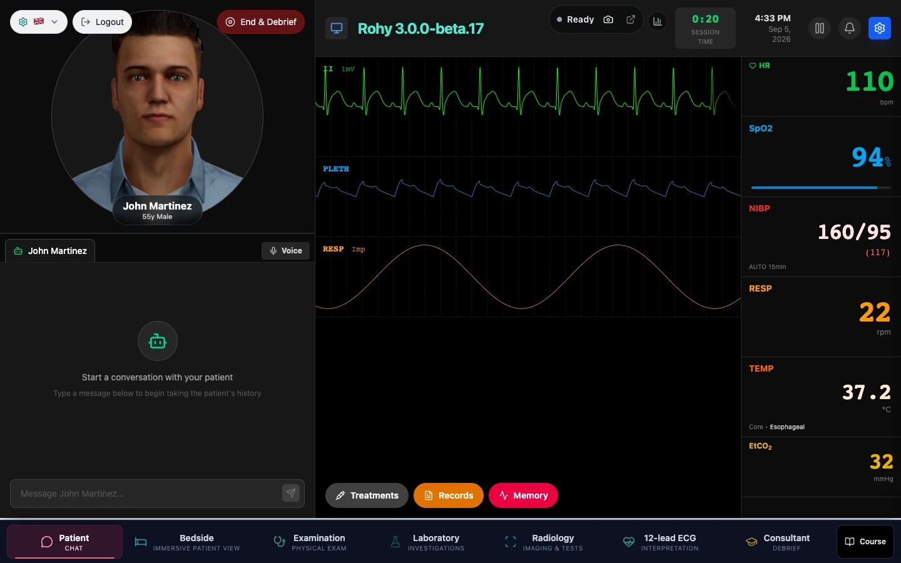
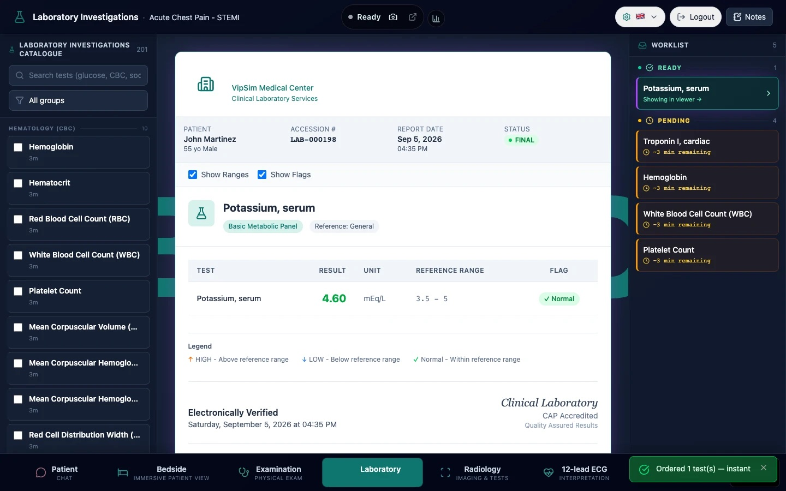
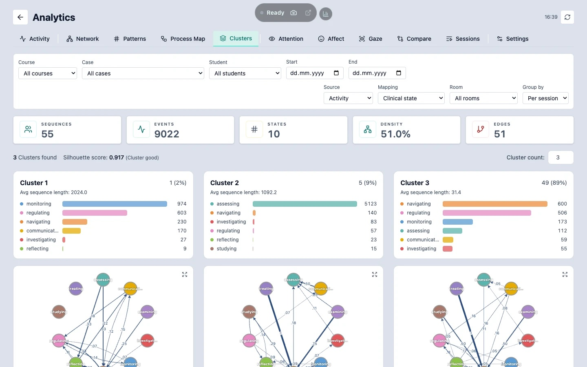

# Rohy

Rohy is an AI-enabled virtual patient simulation platform. It combines conversational virtual patients, physiologically dynamic monitoring, structured examination, laboratory and imaging workflows, therapeutic interventions, multi-agent clinical interactions, post-case debriefing, and learning analytics within a single environment. The emphasis throughout is on preserving the sequence and context of learner actions.

A case unfolds as a continuous encounter: the learner takes a history, examines the patient, orders and interprets investigations, administers treatment, monitors the response, and communicates with other clinical roles. Session records connect these actions to their timing, room, case and learner context, supporting review of how the encounter developed.

[Product guide](docs/product/index.md) · [Installation](docs/INSTALL.md) · [Documentation](docs/index.md) · [Releases](https://github.com/mohsaqr/rohySimulator/releases) · [CI](https://github.com/mohsaqr/rohySimulator/actions/workflows/ci.yml)

## What Rohy brings together

| Area | What it supports |
|---|---|
| Virtual patients | Text and voice conversations, animated avatars, and case-specific patient personas. |
| Monitoring and scenarios | Evolving vital signs, ECG rhythms, alarms, scenario events, and physiological responses to interventions. |
| Structured examination | Anatomical region and technique selection, examination findings, and an examination log. |
| Investigations | Laboratory and imaging catalogues, ordering, turnaround times, worklists, and result interpretation. |
| Therapeutic interventions | Medications, fluids, oxygen and nursing actions, with configured effects over time. |
| Clinical interactions | Patient, nurse, consultant and relative roles with distinct personas, plus a separate debrief discussant. |
| Specialist workspaces | A Bedside view, a twelve-lead ECG workstation, a PACS imaging room, and a pathology slide viewer. Availability follows case content and room configuration. |
| Debrief | Encounter records and a dedicated discussant for reflection after the case. |
| Learning analytics | Action sequences, transition networks, recurring patterns, clustering, and comparisons across sessions and learners. |

Educators can author cases and scenarios, organize courses, cohorts and lessons, and review learner activity. Administrators manage users, roles, tenant settings and provider configuration.

Conversation can use hosted or local LLM endpoints. Speech supports Kokoro, Piper, Google and OpenAI providers. The interface supports English, Italian, Finnish, Swedish, German, Spanish, French and Kazakh; case language is configured independently of interface language.

Oyon provides optional multimodal capture and analytics. Available signals depend on deployment settings and the consent contract. See [learning analytics](docs/product/analytics.md) and [Oyon governance](docs/security/oyon-ai-act.md) for scope, data handling and interpretation.

## A look inside



The patient room brings the conversation, live monitor, treatment controls and session navigation together.



Investigation workspaces connect ordering and turnaround with reports and the learner's worklist.



Learning analytics retain the structure of action sequences for reviewing workflows across encounters.

More views: [screenshot gallery](website/screenshots.html) and [room guide](docs/trainee/rooms.md).

## Getting started locally

Use Node.js **22.x**, npm, Git, Bash, `curl`, and a SHA-256 utility (`sha256sum` or `shasum`). Dependency installation downloads the Oyon model files and needs network access. If native dependency binaries are unavailable for your system, installation also requires Python 3 and C++ build tools.

Rohy has two local package dependencies: `dynajs` and the Bedside package, `rohy-3d-patient-room`. They must sit beside the Rohy checkout. The helper below installs the Bedside release pinned by this repository. If its repository requires authentication, provide `ROOM3D_GIT_TOKEN` to the helper.

```bash
git clone https://github.com/mohsaqr/rohySimulator.git
cd rohySimulator

git clone https://github.com/mohsaqr/dynajs.git ../dynajs
(cd ../dynajs && npm install)
bash scripts/clone-room3d.sh ../3D

npm install
cp server/.env.example server/.env
```

Edit `server/.env` before starting. Replace the example `JWT_SECRET` with a long random secret and keep `PORT=3000` for the development proxy. Generate a secret locally with:

```bash
node -e "console.log(require('node:crypto').randomBytes(32).toString('hex'))"
```

```bash
npm run dev
```

Open **http://localhost:5173**. The API runs at **http://localhost:3000**. Development installs seed `admin` / `admin123` and `student` / `student123`. Sign in as the administrator to configure an LLM provider and model before running patient conversations. A local LM Studio or another OpenAI-compatible endpoint can be used instead of a hosted provider.

Default development credentials are not the production bootstrap path; see [first administrator setup](docs/ADMIN_FIRST_RUN.md).

Optional setup:

- `npm run setup:content` installs the PACS and Pathology content archives.
- `npm run install:piper` installs local Piper voices.
- `npm run setup:oyon` verifies and re-fetches Oyon models. To enable the add-on routes in a source install, also set `OYON_ENABLED=1` in `server/.env`.

## Other installation paths

Choose the path that matches the target environment:

| Environment | Start here |
|---|---|
| Classroom or single-machine installation | [Local installer](deploy/local-install.sh) and [installation guide](docs/INSTALL.md). |
| Linux service with systemd and a reverse proxy | [Bootstrap installer](deploy/bootstrap.sh), then [deployment guide](docs/DEPLOY.md). |
| Docker built from this checkout | [Compose configuration](deploy/docker/compose.yml) and the example below. |
| Published container image or offline bundle | [Tagged release assets](https://github.com/mohsaqr/rohySimulator/releases), [Docker build/deployment reference](deploy/docker/Dockerfile), and [installation guide](docs/INSTALL.md). |
| Updating or restoring an existing installation | [Update guide](docs/UPDATING.md). |

For a **Docker source build**, run from the Rohy checkout with Docker Compose installed:

```bash
cp deploy/docker/.env.example deploy/docker/.env
# Edit deploy/docker/.env and set ROHY_HOSTNAME to the hostname you will use.
docker compose --env-file deploy/docker/.env -p rohy \
  -f deploy/docker/compose.yml up -d --build
```

This builds the local `rohy:latest` image. The stack includes Caddy and persistent database, upload and model-cache volumes. Its default TLS configuration uses Caddy's internal certificate authority; public HTTPS configuration is described in the [Caddyfile](deploy/docker/Caddyfile) and [deployment guide](docs/DEPLOY.md). Private Bedside repository access during a Docker build uses the build secret described in the [Dockerfile](deploy/docker/Dockerfile).

When deploying a published image, pin the release you intend to run and configure the service to use that image. The version in [`package.json`](package.json) describes this checkout; it can differ from a published release or a running deployment. Use the [changelog](CHANGELOG.md) for source changes and `/api/health` for the running instance's version.

## Development and testing

The client uses React and Vite; the server uses Express and SQLite. Room plugins provide the specialist workspaces, while learning events connect activity to session and analytics records. [Architecture and product documentation](docs/product/platform-technologies-operations.md) describe these components in detail.

| Command | Purpose |
|---|---|
| `npm run dev` | Run the client and API with development reload. |
| `npm run lint` | Check JavaScript and JSX with ESLint. |
| `npm test` | Run client and server Vitest projects. |
| `npm run test:ci` | Run Vitest with coverage and JUnit output. |
| `npm run test:client` / `npm run test:server` | Run one test project. |
| `npm run test:monkey` | Run seeded browser walks against the built application. |
| `npm run docs:dev` / `npm run docs:build` | Preview or build the documentation site. |
| `npm run plugins:check` | Validate plugin manifests, event declarations and locales. |

Browser tests require a build served from the root path:

```bash
npm run test:e2e:install
npm run build:e2e
npm run test:e2e
```

`build:e2e` uses `/` as its asset base. The production `npm run build` uses `/rohy/` and includes the documentation build; it is intended for the corresponding reverse-proxy configuration. These builds are not interchangeable.

Additional checks include the [HTTP audit scripts](scripts/), API fuzzing in [CI](.github/workflows/ci.yml), and [Prova's automated and human test catalogue](prova/README.md). Browser reports and coverage results complement human acceptance checks; they do not record those verdicts.

## Documentation

| Reader | Guide |
|---|---|
| Learners | [First case](docs/trainee/getting-started.md) and [rooms](docs/trainee/rooms.md). |
| Educators | [Case authoring](docs/product/case-authoring.md), [educator guides](docs/educator/), and [learning analytics](docs/product/analytics.md). |
| Administrators | [First administrator session](docs/ADMIN_FIRST_RUN.md) and [administration guides](docs/admin/). |
| Operators | [Installation](docs/INSTALL.md), [deployment](docs/DEPLOY.md), and [updates](docs/UPDATING.md). |
| Developers and integrators | [Integration guides](docs/integrator/) and [API reference](docs/reference/api/). |
| Governance and data handling | [Security documentation](docs/security/). |

The [documentation home](docs/index.md) organizes the full guides by role. The application also links to relevant articles through Help & Support. The public website sources are in [`website/`](website/README.md).

## Author and licence

Created by [Mohammed Saqr](https://www.saqr.me).

Rohy is distributed under the [Carm Research License v1.4](LICENSE). Consult the licence for research, teaching and commercial-use terms. Third-party components are listed in [NOTICE.md](NOTICE.md), with their licence texts under [`licenses/`](licenses/) and [`OyonR/licenses/`](OyonR/licenses/).

For licensing and institutional enquiries: [saqr@saqr.me](mailto:saqr@saqr.me).
